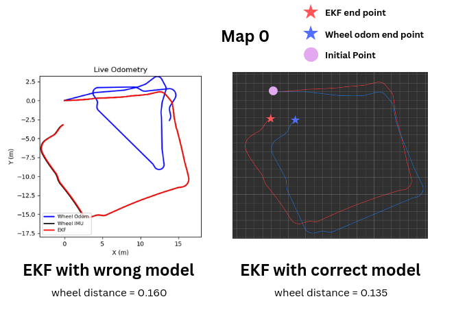
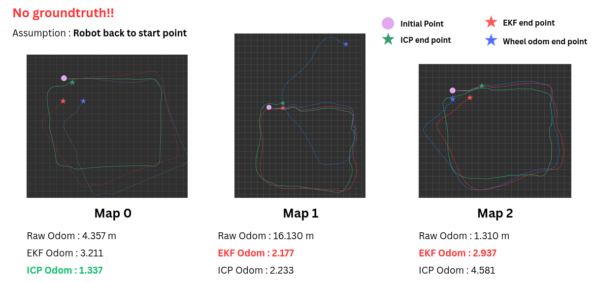
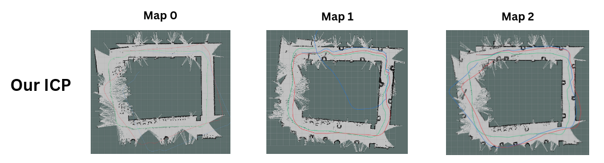
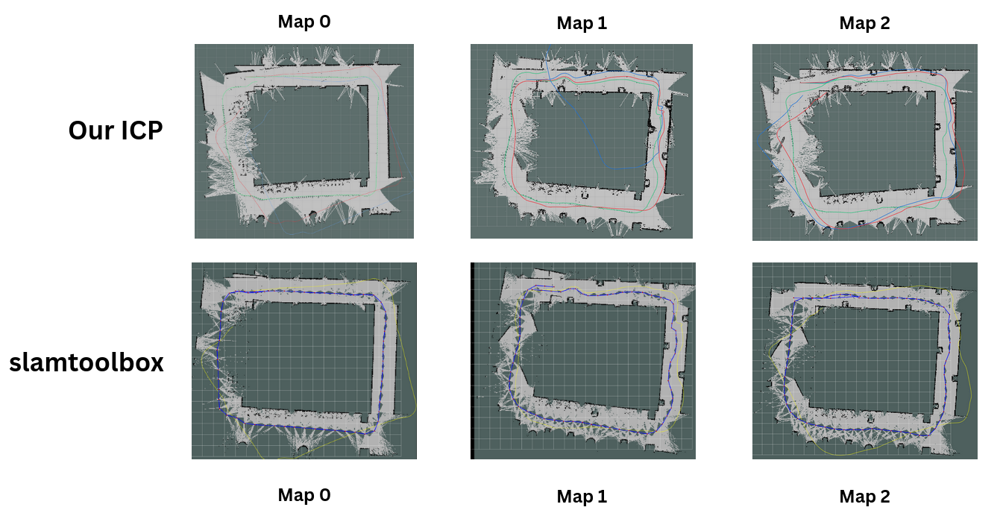
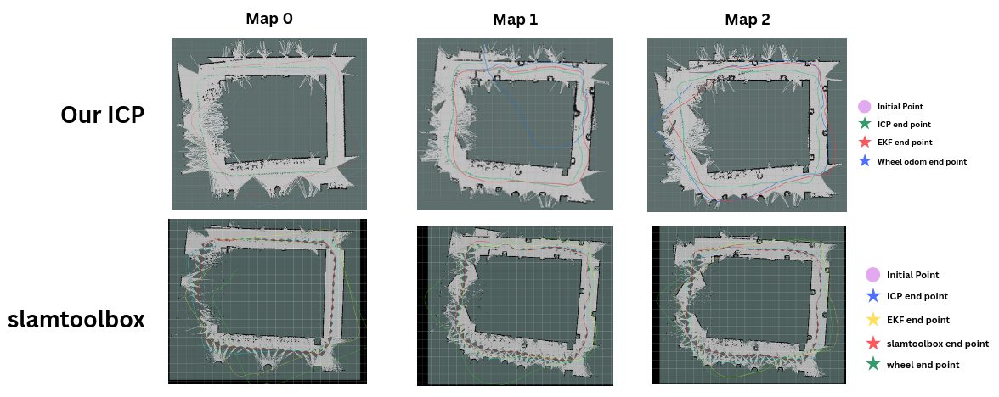

# **FRA532 Mobile Robot: Lab 1 - EKF & SLAM**
- Pavaris Asawakijtananont
- Anuwit Intet 
   - https://github.com/BlackTalae/FRA532_LAB1_ws
## **Table of content**
- [Extended Kalman Filter](#extended-kalman-filter)
- [Iterative Point Cloud](#iterative-point-cloud)
- [Results](#results)
- [Results conclusion](#result-conclusion)
## **Extended Kalman Filter**
### **Robot State**
- Following the instructions, for this homework, we need to obtain odometry from both raw wheeled odometry and fused odometry with IMU data.
- We define the state based on the task at hand. Since we are obtaining low-frequency data (around 20 Hz), we define a simple state that includes the joint state (wheel position, wheel velocity) and IMU data (orientation, angular velocity, linear acceleration).
- The state is given as:

$$
\mathbf{x} = \begin{bmatrix}
x \\
y \\
\theta
\end{bmatrix}
$$

- $x$: robot position along the X-axis relative to the world frame.  
- $y$: robot position along the Y-axis relative to the world frame.
- $\theta$: robot yaw relative to the world frame.

### **Motion Model**
- The motion model will be compared in this section before being fused with other observation models.
- I tested two different motion models from the differential drive robot kinematic model.

#### **Model 1**
This is my first model, where we model the input as the `linear velocity` and `angular velocity` of the robot. Firstly, we assume that there is no slippage in the wheels. We can obtain these values using the following equations:

$$
v_b = \frac{r}{2}(\omega_r + \omega_l)
$$

$$
\omega_b = \frac{r}{L}(\omega_r - \omega_l)
$$

- $v_b $: robot base linear velocity
- $\omega_b$: robot base angular velocity
- $\omega_r$: right wheel joint angular velocity
- $\omega_l$: left wheel joint angular velocity
- $L$: distance between the wheels

$$\mathbf{x}[k+1] = 
\begin{bmatrix}
x[k] \\
y[k] \\
\theta[k]
\end{bmatrix}
+
\begin{bmatrix}
v_b \cos(\theta[k] \Delta t) \\
v_b \sin(\theta[k] \Delta t) \\
\omega_b[k] \Delta t
\end{bmatrix}$$

> The code in this section has been replaced by another model! (This was my first motion model, but it wasn't working.)

  

The result shows that using the velocity as the input for the motion model cannot provide sufficient information to estimate the odometry from the wheels.

#### **Model 2**
We use a **lower-order input**, we model the input as the **delta of joint positions**. The joint positions represent the absolute rotation of the left and right wheels, and we calculate the difference in joint positions between time steps to update the robot's state. 

This approach is useful for scenarios with **low-frequency data** where wheel velocity measurements might not be reliable. By using the **difference of joint positions**, we can estimate the robot's odometry more accurately in such situations.

##### **Delta of Joint Positions:**

For both the left and right wheels, we calculate the difference in position between successive time steps:
$$
\Delta \phi_{\text{left}} = \text{atan2}(\sin(\phi_{\text{left}}[k] - \phi_{\text{left}}[k-1]), \cos(\phi_{\text{left}}[k] - \phi_{\text{left}}[k-1]))
$$

$$
\Delta \phi_{\text{right}} = \text{atan2}(\sin(\phi_{\text{right}}[k] - \phi_{\text{right}}[k-1]), \cos(\phi_{\text{right}}[k] - \phi_{\text{right}}[k-1]))
$$

Where:
- $\phi_{\text{left}}[k]$ and $\phi_{\text{right}}[k]$ are the joint positions of the left and right wheels at time step $k$.
- $\Delta \phi_{\text{left}}$ and $\Delta \phi_{\text{right}}$ represent the changes in the left and right wheel positions (i.e., the angular differences between successive positions).
  
$$\mathbf{x}[k+1] =
\begin{bmatrix}
x[k+1] \\
y[k+1] \\
\theta[k+1]
\end{bmatrix} =
\begin{bmatrix}
x[k] \\
y[k] \\
\theta[k]
\end{bmatrix}
+
\begin{bmatrix}
\frac{r}{2}\left(\Delta\phi_{\mathrm{L}}+\Delta\phi_{\mathrm{R}}\right)\cos\\left(\theta[k]+\frac{\Delta\phi_{\mathrm{R}}-\Delta\phi_{\mathrm{L}}}{2}\right) \\
\frac{r}{2}\left(\Delta\phi_{\mathrm{L}}+\Delta\phi_{\mathrm{R}}\right)\sin\\left(\theta[k]+\frac{\Delta\phi_{\mathrm{R}}-\Delta\phi_{\mathrm{L}}}{2}\right) \\
\frac{r}{L}\left(\Delta\phi_{\mathrm{R}}-\Delta\phi_{\mathrm{L}}\right)
\end{bmatrix}$$

>**ref : https://medium.com/@nahmed3536/wheel-odometry-model-for-differential-drive-robotics-91b85a012299**

<!-- state[0] += self.r*(u[0] + u[1]) / 2.0 * math.cos(state[2] + self.r *(u[1] - u[0])/(2.0*self.L)) -->
<!-- state[1] += self.r*(u[0] + u[1]) / 2.0 * math.sin(state[2] + self.r *(u[1] - u[0])/(2.0*self.L)) -->
<!-- state[2] += self.r*(u[1] - u[0]) / self.L -->
This model is similar to our previous model, but directly use the position of joint instead of joint velocity. The result is shown below.

  

The result show better prediction for estimate the odometry, while using only motion model to estimate. However, we do not know how our odometry good cause of lack of ground truth, we need to enchance by using information of IMU in next step  

### **EKF**
Extended Kalman Filter is used benefit from motion model and observation to predict the state in control system in this work we use to predict the $x,y,\theta$. This model in non-linear version of traditional Kalman Filter, linearize over the current state with first order Taylor series to handle the non-linear system.

Matrix $\mathbf{H}$ selected observable state from the state, selected only $\theta$ from IMU data 
#### **Motion Jacobian Matrix**
EKF handle non-linearity with linearization with first-order Taylor series, represented as Jacobian matrix. We linearize our motion model as:

$$
\frac{\partial \mathbf{x}}{\partial u} =
\begin{bmatrix}
\frac{\partial x}{\partial u_0} & \frac{\partial x}{\partial u_1} & \frac{\partial x}{\partial \theta} \\
\frac{\partial y}{\partial u_0} & \frac{\partial y}{\partial u_1} & \frac{\partial y}{\partial \theta} \\
\frac{\partial \theta}{\partial u_0} & \frac{\partial \theta}{\partial u_1} & \frac{\partial \theta}{\partial \theta}
\end{bmatrix}
$$

In our case, the Jacobian matrix is calculated as:

$$
\begin{bmatrix}
1.0 & 0.0 & -\frac{r(\phi_{\text{left}} - \phi_{\text{right}})}{2} \sin\left( \theta + \frac{r(\phi_{\text{right}} - \phi_{\text{leg}})}{2L} \right) \\
0.0 & 1.0 & \frac{r(\phi_{\text{left}} - \phi_{\text{right}})}{2} \cos\left( \theta + \frac{r(\phi_{\text{right}} - \phi_{\text{left}})}{2L} \right) \\
0.0 & 0.0 & 1.0
\end{bmatrix}
$$

#### **Observation Model & Jacobian**
In this homework, we utilize IMU data, and able to access robot's orientation from IMU sensor. We can use this inforamation to correct the data. The matrix for observation model we define as

$$h(\mathbf{x}) = \begin{bmatrix} 0 & 0 & 1\end{bmatrix}^{T}$$

Similar to motion jacobian we use taylor series to linearize from observation

$$\mathbf{H} = 
\begin{bmatrix} 
0 & 0 & 0 \\
0 & 0 & 0 \\
0 & 0 & 1 \\
\end{bmatrix}$$

#### **Parameters**

##### **1. Process Noise Covariance Matrix $Q$**

The **process noise covariance matrix** $Q$ models the uncertainty in the motion model and accounts for any noise introduced during the robot's movement. It represents how much we trust the robot's motion model to predict the next state. A larger value for $Q$ indicates higher uncertainty in the predicted state.

My $Q$ is defined as:

$$
Q = \begin{bmatrix}
0.01 & 0 & 0 \\
0 & 0.01 & 0 \\
0 & 0 & 0.05
\end{bmatrix}
$$

- The first two diagonal elements represent the uncertainty in the robot’s linear motion ($x$ and $y$).
- The third diagonal element represents the uncertainty in the robot's orientation $\theta$.

We have assumption that difference states have no correlation to each other

##### **2. Measurement Noise Covariance Matrix $R$**

The **measurement noise covariance matrix** $R$ represents the uncertainty in the sensor measurements. It accounts for noise in the observed data and how much we trust the sensor data relative to the motion model.

My $R$ is defined as:

$$
R = \begin{bmatrix}
0.1 & 0 & 0 \\
0 & 0.1 & 0 \\
0 & 0 & 0.1
\end{bmatrix}
$$

- The diagonal elements represent the uncertainty in the sensor measurements for the robot's orientation (yaw, pitch, and roll). A larger value in these elements indicates higher uncertainty in the sensor measurements.

The measurement noise is typically based on the accuracy and reliability of the sensors

##### **3. Predicted State Covariance Matrix $P$**

The **predicted state covariance matrix** $P$ represents the uncertainty of the predicted state after applying the motion model. It describes how uncertain we are about the predicted state, which will be updated after each measurement is taken.

My $P$ is initialized as:

$$
P_{\text{Pred}} = \begin{bmatrix}
0.01 & 0 & 0 \\
0 & 0.01 & 0 \\
0 & 0 & 0.05
\end{bmatrix}
$$

- The first two diagonal elements represent the uncertainty in the robot’s position ($x$ and $y$).
- The third diagonal element represents the uncertainty in the robot's orientation ($\theta$).

This matrix is updated during the prediction step using the Jacobian of the motion model and process noise covariance.

### **4. Estimated State Covariance Matrix ($P_{\text{Est}}$)**

The **estimated state covariance matrix** ($P_{\text{Est}}$) represents the uncertainty in the estimated state after the measurement update step. It is used to track the uncertainty in the final estimated state of the robot after both the prediction and update steps.

In my code, ($P_{\text{Est}}$) is initialized as:

$$
P_{\text{Est}} = \begin{bmatrix}
0.01 & 0 & 0 \\
0 & 0.01 & 0 \\
0 & 0 & 0.02
\end{bmatrix}
$$

- The first two diagonal elements represent the uncertainty in the robot’s position ($x$ and $y$).
- The third diagonal element represents the uncertainty in the robot's orientation ($\theta$).

This matrix is updated after each prediction and correction step to reduce the uncertainty in the state estimate.

> Should be note that our hyperparameters doesn't good fine tuning to do estimated the task

#### Motion Model & EKF Result
Our results from integrating the motion model and IMU data significantly enhance our odometry, particularly for 
θ
θ in the odometry.

  

- (Left) Although our odometry performance has improved, a gap can still be observed at the end of the path. Additionally, we compared our EKF estimator to both the raw wheeled odometry and raw wheeled odometry with IMU data used for yaw estimation. The comparison shows that the EKF has similar performance to using only the yaw data from the IMU, with no significant difference.
- (Right) **I just Remember that I use wrong value of distance between wheel in motion model**, but the **EKF has the similar performance with wrong model**. But
after change the motion model wheel odometry significantly better.

## Iterative Point Cloud (ICP Refinement)

In this section, we enhance EKF-based odometry using the Iterative Closest Point (ICP) algorithm. ICP refines the robot pose by aligning the current laser scan (converted to a point cloud) with a reference map. Since vanilla ICP is not designed for SLAM, we modify the pipeline with several key features to make it more stable and SLAM-compatible. In this work, we use the **point-to-point** ICP method for scan alignment.

### Key Features for SLAM Compatibility

Vanilla ICP is not directly suitable for SLAM because it is sensitive to drift, outliers, and local minima. To address this, we add the following features:

1. **Keyframe-Based Mapping**  
   Instead of using every scan, the system selects **keyframes** based on distance and/or rotation thresholds. This reduces computational cost, avoids redundant map updates, and helps limit accumulated error over time.

2. **Local Map Extraction**  
   Rather than matching against the entire global map, ICP aligns the scan only with a **local submap** within a fixed radius (e.g., **6 m**). This makes computation more tractable, improves robustness to global drift, and supports real-time operation.

3. **Jump Detection & Validation**  
   The ICP output pose is rejected if it produces an aggressive motion jump beyond predefined bounds. In that case, the system falls back to EKF odometry to prevent incorrect pose updates.

4. **Failure Handling (Fallback to EKF)**  
   If ICP fails (e.g., not enough valid points, poor convergence, or unreliable matching), the system uses EKF odometry instead to avoid applying a wrong alignment.

### ICP Process

1. Subscribe to the `/scan` topic (from rosbag or live) and convert each scan into a point cloud using the current odometry estimate.  
2. Preprocess the point cloud to reduce noise and improve stability. Common methods include **outlier rejection** and **voxel grid downsampling** to remove spurious points and reduce redundancy.  
3. Use the current scan point cloud as the **source**, and match it against the **target**, which is either the previous scan or (in our case) the **local map**.  
4. Perform data association using **KNN** with **K = 1** (nearest neighbor) to find correspondences between source points and target points. This work considers only **point-to-point** correspondences.  
5. Run ICP optimization using the current odometry / EKF pose as the **initial guess**, then estimate the rigid transformation via **SVD (Singular Value Decomposition)**. The result is a rotation matrix ($R$) and translation vector ($T$).  
6. Validate the result by checking alignment error and motion limits. If the update exceeds the allowed bounds (jump detected), reject it and use EKF odometry instead.  
7. If accepted, update the robot pose and refresh the **local map** and **keyframe set**.

## **Results** 
Our results have 2 section, first is compare the odometry each algorithm. Second, compared the map quality between `our ICP` and `SLAM TOOLBOX`
> **Since we don't have groudtruth on dataset**, we cannot evaluate the real performance on each map, we consider 2 factor is odometry shape, map 

### Odometry Quality
- we will estimate odometry quality by using the difference of starting point and end point of each algorithm for each map, this method has strong assumption that all of dataset must return to starting point

  

- `Map 0` : ICP achieves the smallest loop-closure error, suggesting that scan matching helps correct accumulated heading/pose drift. In contrast, both raw wheel odometry and EKF show significant drift after the first turn, leading to a larger start–end distance.
- `Map 1` : The raw wheel odometry fails after the sharp turn and diverges significantly. Both EKF and ICP remain stable and end much closer to the starting point, indicating EKF can .
- `Map 2` : EKF and raw odometry follow a similar trajectory pattern to Map 0, while the ICP trajectory appears to return to an earlier (previous) path. However, the raw odometry has the smallest loop-closure error in this run.

These results show that a pure loop-closure metric (start–end distance) is not sufficient to identify the best odometry solution. A small loop-closure error can still occur even when the trajectory is incorrect (e.g., due to taking a wrong path or local misalignment). Therefore, we should evaluate odometry using additional evidence—such as the map consistency/quality produced by ICP mapping or a SLAM reference (e.g., slam_toolbox)—and treat these as stronger baselines than loop-closure distance alone.

### Map Quality

  

From the results, both the trajectory and the map indicate that ICP can improve EKF odometry by reducing accumulated drift and bringing the estimated end pose closer to the initial path. However, none of the reconstructed maps are perfect: all maps show some drift near the end of the run. Notably, Map 1 is the only case where the drift is clearly upward, suggesting a different failure mode or alignment bias compared with the other maps.

For Map 2, the ICP trajectory is able to reconnect and form a more consistent loop in the map (even if it is not perfectly closed). This suggests that, in this scenario, ICP provides a more reliable odometry estimate than the other methods that fail to return near the starting region. Although the final ICP pose is still shifted to the right of the initial pose, the overall trajectory and map consistency support the conclusion that a lower loop-closure error alone is not sufficient, and that map/trajectory consistency should also be considered when judging which odometry is best.

## **SLAM TOOLBOX**
- This part is collaborate with **`Mr.Anuwit Intet`**, 
- Meanwhile, `slamtoolbox` including with many feature including, lifelong mapping, interative tools allow manual loop closure by moving the node and connection. For more detail please visit **https://github.com/BlackTalae/AMR_LAB1_ws**

To compare the performance we will use vanilla version on slamtoolbox 
> *slamtoolbox reference : https://github.com/SteveMacenski/slam_toolbox*

### MAP

  

The maps produced by `slam_toolbox` and our `ICP` method are generally quite similar. The main exception is `map 2`, where the slam_toolbox map appears closest to a “perfect” closed loop, indicating stronger **loop-closure** behavior. Although, `slamtoolbox` do not perform loop closure in our experiments. For `map 0` and `map 1`, the results are not significantly different from our `ICP` maps. In `map 1`, `slamtoolbox` show the feature of node optimization by delete some redundant node from the scan when face the sharping turn, this action can help the algorimth robust to hallucination from sharp turning

We also observe that the slam_toolbox trajectory/map updates are denser (i.e., the update interval is smaller) than ours. This is expected because slam_toolbox typically updates the pose at nearly every scan, while our ICP pipeline uses keyframes to insert points into the local map. Despite using fewer updates, our ICP approach can still achieve a nearly closed loop in the reconstructed map.

### ODOM

  

From the result show that loop closure error cannot indicate the best odometry from difference algoithm, but in term of odometry shape, although other odometry get less distance error, but if we compare in term of tracking the map,despite not perfect map, `ICP` odometry and `slamtoolbox` odometry is better than other odometry. If we use map from `wheel odom` , `EKF odom` it will show more drifter map than `ICP` and `slamtoolbox`. From `slamtoolbox` and `ICP` map these map show only `ICP`,`slamtoolbox` can follow the most closest perfect map while other odom drift off to the map

### Result Conclusion

#### EKF and Motion Model
- A pure motion model depends entirely on how accurate the model is. If the model is incorrect, the estimated trajectory will also be incorrect.In practice, we cannot model all sources of uncertainty (e.g., wheel slip, friction changes, floor disturbance, and unmodeled dynamics).
- To handle these uncertainties, we fuse a measurement model with the motion model using an EKF. The EKF dynamically balances the contribution (weight) between prediction and measurement, which improves odometry—especially the **yaw** estimate. This leads to better map alignment in the later results.

#### EKF and ICP
- Compared with EKF-only odometry, our ICP refinement generally improves performance by using **LiDAR scan matching** to align the current scan with the local map and correct the pose estimate.
- However, in **Map 1**, EKF and ICP performance is not significantly different. This is likely because **ICP becomes less reliable during sharp turns**. From the point cloud behavior, the scan alignment tends to drift at each turn (mainly in yaw), causing ICP to output less accurate updates.
- In contrast, EKF can remain stable because it uses a yaw measurement (IMU) to correct the state and does not rely solely on scan alignment.

#### ICP and slam_toolbox
- The maps produced by ICP and `slam_toolbox` are generally similar, but `slam_toolbox` shows stronger global consistency in some runs.
- In **Map 1**, neither method produces a clear closed-loop map.
- In **Map 0** and **Map 2**, `slam_toolbox` produces a map that is closer to a well-aligned loop, while our ICP map shows more noticeable drift.
- Quantitative evaluation is still difficult without ground-truth trajectory. Qualitatively, our ICP map sometimes contains more dense scan information because we integrate scans differently, whereas `slam_toolbox` produces a cleaner map overall.
- A key limitation for both methods is the lack of strong geometric constraints during turning. Missing or ambiguous features at corners can cause scan matching to degrade, leading to drift after the robot passes a turning point.
- In `slamtoolbox` it not just only including with `ICP` or scan matching but it also including with **Loop closure**, **Graph optimization** 

### Overall Conclusion
- Each method has its own strengths. With richer and more reliable sensor information, we could achieve more robust and accurate mapping/SLAM.
- Further improvements require better preprocessing and tuning, such as IMU calibration, scan filtering/outlier rejection, and **more hyperparameter tuning**.

#### Robustness and Accuracy
- In general, ICP and `slam_toolbox` provide robust odometry because scan matching can correct accumulated drift.
- However, **Map 1** shows that poor scan information (especially during sharp turns) can degrade scan-matching performance and increase error.
- EKF can still achieve comparable performance in some cases because it does not require scan matching and can rely on IMU yaw correction instead.
- Across all runs, most trajectories and maps show a consistent shift around turning regions (often near the bottom-right corridor). This likely comes from two main causes:
  1. The IMU yaw measurement is not perfectly calibrated, so heading correction is imperfect.
  2. Scan matching struggles to find reliable correspondences at corners due to limited features or occlusions, causing missing/unstable alignments. When scan updates are rejected or fail, the system falls back to odometry, which increases accumulated drift.
- To improve robustness, ICP updates should be integrated into the EKF as an additional measurement (not only IMU yaw). In our current implementation, EKF odometry and ICP-refined odometry are still computed separately, but combining them within a single EKF framework could improve stability and consistency.

### Overall Conclusion (Motion Model, EKF, ICP, and `slam_toolbox`)

Each method contributes differently, and the best mapping/SLAM performance comes from combining complementary information. In general, richer and more reliable sensor inputs lead to more robust and accurate localization, while poor measurements or weak geometric features can cause drift and misalignment. Therefore, both **sensor quality** and **algorithm tuning** strongly affect the final results.

#### Motion Model (Dead-Reckoning)
The motion model predicts the robot’s next pose using kinematics (e.g., wheel encoders and differential-drive equations). This approach is simple and produces smooth trajectories, but it accumulates error over time. In real environments, it is difficult to model all uncertainty sources—such as wheel slip, friction variation, disturbances, and imperfect parameters (wheel radius and wheelbase). Small heading errors are especially harmful because yaw drift quickly becomes large position drift after turns.

#### EKF (Sensor Fusion)
The EKF improves dead-reckoning by fusing the motion model (prediction) with sensor measurements (correction), such as IMU yaw. This fusion dynamically balances the contribution of prediction and measurement, which often improves odometry stability and reduces drift—especially in **yaw**. However, EKF performance depends on measurement quality.  In addition, EKF cannot “see” the environment structure unless map-related measurements (e.g., scan matching) are included.

#### ICP (LiDAR Scan Matching Refinement)
ICP refines odometry by aligning the current LiDAR scan (source) with a reference map or local submap (target). This allows ICP to correct accumulated drift in both position and heading, especially when the environment provides clear geometric constraints and good scan overlap. However, ICP can be unreliable in challenging conditions—such as sharp turns (low overlap), feature-poor corridors (degenerate geometry), dynamic objects, or noisy scans—causing convergence to local minima or incorrect pose updates. On the other hand, without noisy scans ICP may cannot found th unique feature in the map

#### `slam_toolbox` (Full SLAM Back-End with Loop Closure)
`slam_toolbox` typically provides a more complete SLAM pipeline than local ICP refinement. It continuously performs scan matching and can apply **loop closure** and **global optimization** (pose graph correction) when revisiting locations. As a result, `slam_toolbox` often produces cleaner and more globally consistent maps, especially in scenarios where loop closure is successfully detected(not in this work). Nevertheless, it still depends on sensor quality and tuning; inaccurate odometry/IMU or poor scan quality can degrade performance.

> 

> 

### Reference

Collaborator : https://github.com/BlackTalae/FRA532_LAB1_ws

Presentation Slide : https://www.canva.com/design/DAHBGQt0iWQ/pEniAY8PZd4fy1aPmfsX4Q/view?utm_content=DAHBGQt0iWQ&utm_campaign=designshare&utm_medium=link2&utm_source=uniquelinks&utlId=h37da07444c

Differential Drive Model : https://medium.com/@nahmed3536/wheel-odometry-model-for-differential-drive-robotics-91b85a012299

RoboticsPython : https://github.com/AtsushiSakai/PythonRobotics

slamtoolbox : https://github.com/SteveMacenski/slam_toolbox
