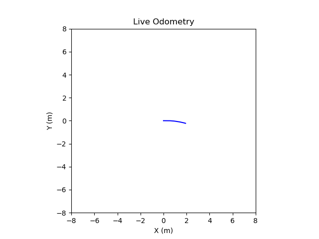
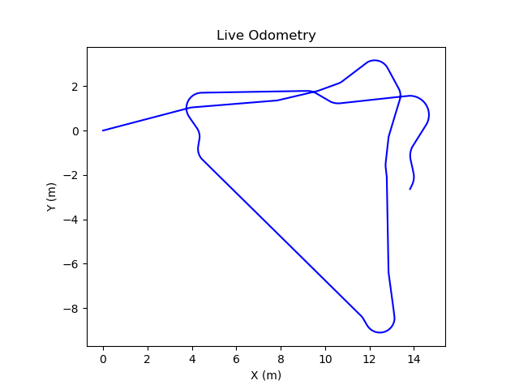
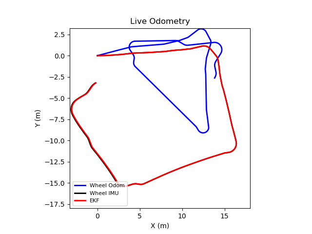

# **FRA532 Mobile Robot: Lab 1 - EKF & SLAM**
## **Extended Kalman Filter**
### **Robot State**
- Following the instructions, for this homework, we need to obtain odometry from both raw wheeled odometry and fused odometry with IMU data.
- We define the state based on the task at hand. Since we are obtaining low-frequency data (around 20 Hz), we define a simple state that includes the joint state (wheel position, wheel velocity) and IMU data (orientation, angular velocity, linear acceleration).
- The state is given as:

$$
\mathbf{x} = \begin{bmatrix}
u \\
v \\
\theta
\end{bmatrix}
$$

- $x$: robot position along the X-axis relative to the world frame.  
- $y$: robot position along the Y-axis relative to the world frame.
- $\theta$: robot yaw relative to the world frame.

### **Motion Model**
- The motion model will be compared in this section before being fused with other observation models.
- I tested two different motion models from the differential drive robot kinematic model.

#### **Model 1**
This is my first model, where we model the input as the `linear velocity` and `angular velocity` of the robot. Firstly, we assume that there is no slippage in the wheels. We can obtain these values using the following equations:

$$
v_b = \frac{r}{2}(\omega_r + \omega_l)
$$

$$
\omega_b = \frac{r}{L}(\omega_r - \omega_l)
$$

- $v_b $: robot base linear velocity
- $\omega_b$: robot base angular velocity
- $\omega_r$: right wheel joint angular velocity
- $\omega_l$: left wheel joint angular velocity
- $L$: distance between the wheels

$$\mathbf{x}[k+1] = 
\begin{bmatrix}
x[k] \\
y[k] \\
\theta[k]
\end{bmatrix}
+
\begin{bmatrix}
v_b \cos(\theta[k] \Delta t) \\
v_b \sin(\theta[k] \Delta t) \\
\omega_b[k] \Delta t
\end{bmatrix}$$

> The code in this section has been replaced by another model! (This was my first motion model, but it wasn't working.)

  

The result shows that using the velocity as the input for the motion model cannot provide sufficient information to estimate the odometry from the wheels.

#### **Model 2**
We use a **lower-order input**, we model the input as the **delta of joint positions**. The joint positions represent the absolute rotation of the left and right wheels, and we calculate the difference in joint positions between time steps to update the robot's state. 

This approach is useful for scenarios with **low-frequency data** where wheel velocity measurements might not be reliable. By using the **difference of joint positions**, we can estimate the robot's odometry more accurately in such situations.

##### **Delta of Joint Positions:**

For both the left and right wheels, we calculate the difference in position between successive time steps:
$$
\Delta \phi_{\text{left}} = \text{atan2}(\sin(\phi_{\text{left}}[k] - \phi_{\text{left}}[k-1]), \cos(\phi_{\text{left}}[k] - \phi_{\text{left}}[k-1]))
$$

$$
\Delta \phi_{\text{right}} = \text{atan2}(\sin(\phi_{\text{right}}[k] - \phi_{\text{right}}[k-1]), \cos(\phi_{\text{right}}[k] - \phi_{\text{right}}[k-1]))
$$

Where:
- $\phi_{\text{left}}[k]$ and $\phi_{\text{right}}[k]$ are the joint positions of the left and right wheels at time step $k$.
- $\Delta \phi_{\text{left}}$ and $\Delta \phi_{\text{right}}$ represent the changes in the left and right wheel positions (i.e., the angular differences between successive positions).
  
$$\mathbf{x}[k+1] =
\begin{bmatrix}
x[k+1] \\
y[k+1] \\
\theta[k+1]
\end{bmatrix} =
\begin{bmatrix}
x[k] \\
y[k] \\
\theta[k]
\end{bmatrix}
+
\begin{bmatrix}
\frac{r}{2}\left(\Delta\phi_{\mathrm{L}}+\Delta\phi_{\mathrm{R}}\right)\cos\!\left(\theta[k]+\frac{\Delta\phi_{\mathrm{R}}-\Delta\phi_{\mathrm{L}}}{2}\right) \\
\frac{r}{2}\left(\Delta\phi_{\mathrm{L}}+\Delta\phi_{\mathrm{R}}\right)\sin\!\left(\theta[k]+\frac{\Delta\phi_{\mathrm{R}}-\Delta\phi_{\mathrm{L}}}{2}\right) \\
\frac{r}{L}\left(\Delta\phi_{\mathrm{R}}-\Delta\phi_{\mathrm{L}}\right)
\end{bmatrix}$$

>**ref : https://medium.com/@nahmed3536/wheel-odometry-model-for-differential-drive-robotics-91b85a012299**

<!-- state[0] += self.r*(u[0] + u[1]) / 2.0 * math.cos(state[2] + self.r *(u[1] - u[0])/(2.0*self.L)) -->
<!-- state[1] += self.r*(u[0] + u[1]) / 2.0 * math.sin(state[2] + self.r *(u[1] - u[0])/(2.0*self.L)) -->
<!-- state[2] += self.r*(u[1] - u[0]) / self.L -->
This model is similar to our previous model, but directly use the position of joint instead of joint velocity. The result is shown below.

  

The result show better prediction for estimate the odometry, while using only motion model to estimate. However, we do not know how our odometry good cause of lack of ground truth, we need to enchance by using information of IMU in next step  

### **EKF**
Extended Kalman Filter is used benefit from motion model and observation to predict the state in control system in this work we use to predict the $x,y,\theta$. This model in non-linear version of traditional Kalman Filter, linearize over the current state with first order Taylor series to handle the non-linear system.

Matrix $\mathbf{H}$ selected observable state from the state, selected only $\theta$ from IMU data 
#### **Motion Jacobian Matrix**
EKF handle non-linearity with linearization with first-order Taylor series, represented as Jacobian matrix. We linearize our motion model as:

$$
\frac{\partial \mathbf{x}}{\partial u} =
\begin{bmatrix}
\frac{\partial x}{\partial u_0} & \frac{\partial x}{\partial u_1} & \frac{\partial x}{\partial \theta} \\
\frac{\partial y}{\partial u_0} & \frac{\partial y}{\partial u_1} & \frac{\partial y}{\partial \theta} \\
\frac{\partial \theta}{\partial u_0} & \frac{\partial \theta}{\partial u_1} & \frac{\partial \theta}{\partial \theta}
\end{bmatrix}
$$

In our case, the Jacobian matrix is calculated as:

$$
\begin{bmatrix}
1.0 & 0.0 & -\frac{r(\phi_{\text{left}} - \phi_{\text{right}})}{2} \sin\left( \theta + \frac{r(\phi_{\text{right}} - \phi_{\text{leg}})}{2L} \right) \\
0.0 & 1.0 & \frac{r(\phi_{\text{left}} - \phi_{\text{right}})}{2} \cos\left( \theta + \frac{r(\phi_{\text{right}} - \phi_{\text{left}})}{2L} \right) \\
0.0 & 0.0 & 1.0
\end{bmatrix}
$$

#### **Observation Model & Jacobian**
In this homework, we utilize IMU data, and able to access robot's orientation from IMU sensor. We can use this inforamation to correct the data. The matrix for observation model we define as

$$
\mathbf{H} = \begin{bmatrix} 0 & 0 & 1\end{bmatrix}
$$

Similar to motion jacobian we use taylor series to linearize from observation

$$
\mathbf{H} = 
\begin{bmatrix} 
0 & 0 & 0 \\
0 & 0 & 0 \\
0 & 0 & 1 \\

\end{bmatrix}
$$

#### **Parameters**

##### **1. Process Noise Covariance Matrix $Q$**

The **process noise covariance matrix** $Q$ models the uncertainty in the motion model and accounts for any noise introduced during the robot's movement. It represents how much we trust the robot's motion model to predict the next state. A larger value for $Q$ indicates higher uncertainty in the predicted state.

My $Q$ is defined as:

$$
Q = \begin{bmatrix}
0.01 & 0 & 0 \\
0 & 0.01 & 0 \\
0 & 0 & 0.05
\end{bmatrix}
$$

- The first two diagonal elements represent the uncertainty in the robot’s linear motion ($x$ and $y$).
- The third diagonal element represents the uncertainty in the robot's orientation $\theta$.

We have assumption that difference states have no correlation to each other

##### **2. Measurement Noise Covariance Matrix $R$**

The **measurement noise covariance matrix** $R$ represents the uncertainty in the sensor measurements. It accounts for noise in the observed data and how much we trust the sensor data relative to the motion model.

My $R$ is defined as:

$$
R = \begin{bmatrix}
0.1 & 0 & 0 \\
0 & 0.1 & 0 \\
0 & 0 & 0.1
\end{bmatrix}
$$

- The diagonal elements represent the uncertainty in the sensor measurements for the robot's orientation (yaw, pitch, and roll). A larger value in these elements indicates higher uncertainty in the sensor measurements.

The measurement noise is typically based on the accuracy and reliability of the sensors

##### **3. Predicted State Covariance Matrix $P$**

The **predicted state covariance matrix** $P$ represents the uncertainty of the predicted state after applying the motion model. It describes how uncertain we are about the predicted state, which will be updated after each measurement is taken.

My $P$ is initialized as:

$$
P_{\text{Pred}} = \begin{bmatrix}
0.01 & 0 & 0 \\
0 & 0.01 & 0 \\
0 & 0 & 0.05
\end{bmatrix}
$$

- The first two diagonal elements represent the uncertainty in the robot’s position ($x$ and $y$).
- The third diagonal element represents the uncertainty in the robot's orientation ($\theta$).

This matrix is updated during the prediction step using the Jacobian of the motion model and process noise covariance.

### **4. Estimated State Covariance Matrix ($P_{\text{Est}}$)**

The **estimated state covariance matrix** ($P_{\text{Est}}$) represents the uncertainty in the estimated state after the measurement update step. It is used to track the uncertainty in the final estimated state of the robot after both the prediction and update steps.

In my code, ($P_{\text{Est}}$) is initialized as:

$$
P_{\text{Est}} = \begin{bmatrix}
0.01 & 0 & 0 \\
0 & 0.01 & 0 \\
0 & 0 & 0.02
\end{bmatrix}
$$

- The first two diagonal elements represent the uncertainty in the robot’s position ($x$ and $y$).
- The third diagonal element represents the uncertainty in the robot's orientation ($\theta$).

This matrix is updated after each prediction and correction step to reduce the uncertainty in the state estimate.

> Should be note that our hyperparameters doesn't good fine tuning to do estimated the task

#### Result
Our results from integrating the motion model and IMU data significantly enhance our odometry, particularly for 
θ
θ in the odometry.

  

Although our odometry performance has improved, a gap can still be observed at the end of the path. Additionally, we compared our EKF estimator to both the raw wheeled odometry and raw wheeled odometry with IMU data used for yaw estimation. The comparison shows that the EKF has similar performance to using only the yaw data from the IMU, with no significant difference.
